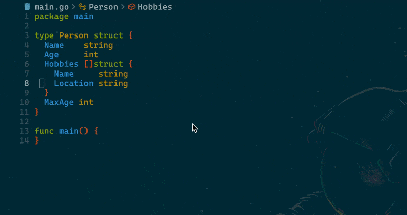

# gomodifytags.nvim

`gomodifytags.nvim` is a Neovim plugin designed to simplify the process of managing struct tags in Go (Golang) code. This plugin provides commands to add or remove tags from Go structs quickly and efficiently, enhancing your workflow by integrating directly with Neovim.



### Key Features:
- **GoAddTags**: Adds custom tags to struct fields in Go files.
- **GoRemoveTags**: Removes specific tags from struct fields.
- **GoInstallModifyTagsBin**: Installs the `gomodifytags` binary, a tool required for modifying struct tags in Go.

By utilizing the `gomodifytags` tool, `gomodifytags.nvim` allows developers to automate repetitive tag management tasks, making it easier to maintain code consistency and readability in Go projects. 

This plugin is for Go developers who prefer using Neovim and want to streamline the process of adding or removing tags like `json`, `xml`, or custom tags to Go structs.

## Install

To install `gomodifytags.nvim` using [Lazy](https://github.com/folke/lazy.nvim):

```lua
{
  "zgs225/gomodifytags.nvim",
  cmd = { "GoAddTags", "GoRemoveTags", "GoInstallModifyTagsBin" },
  config = function()
    require("gomodifytags").setup() -- Optional: You can add any specific configuration here if needed.
  end,
},
```

### Post-install steps:
The plugin requires the `gomodifytags` binary to function. After installing, if needed, you can manually install the binary by running:

```bash
:GoInstallModifyTagsBin
```

This command downloads and installs the `gomodifytags` tool, which the plugin uses to manage struct tags.

## Configuration

`gomodifytags.nvim` provides a set of customizable options that can be configured to tailor the behavior of the plugin to your workflow. Below are the available options and their descriptions.

### Default Configuration

The default configuration can be overridden by specifying your own options in your Neovim configuration file.

```lua
require("gomodifytags").setup({
  override = false,        -- (boolean) Whether to override existing tags when adding new ones.
  skip_unexported = false, -- (boolean) Whether to skip unexported fields in structs.
  sort = false,            -- (boolean) Whether to sort the tags alphabetically by the tag key.
  transform = "snakecase", -- (string) How to transform field names when adding tags.
                           -- Options: "snakecase" | "camelcase" | "lispcase" | "pascalcase" | "titlecase" | "keep"
})
```

### Example Configuration

If you'd like to change some of the default settings, you can pass the desired options into the setup function. For instance:

```lua
require("gomodifytags").setup({
  override = true,
  skip_unexported = true,
  sort = true,
  transform = "camelcase",
})
```

## Usage

`gomodifytags.nvim` provides three main commands for managing Go struct tags. Below are the commands with examples to demonstrate their usage.

### 1. `:GoAddTags`

The `:GoAddTags` command allows you to add tags to Go struct fields. You can specify multiple tags, with each tag and its options separated by spaces. Options for each tag can be added using a comma.

- **Syntax:**
  ```bash
  :GoAddTags [tags]
  ```

  - If no tags are provided, the command will add the `json` tag by default.
  - To add multiple tags, separate them with spaces.
  - To add options for a tag, append them after the tag name, separated by a comma.

- **Examples:**

  1. **Add the `json` tag (default behavior):**
     ```bash
     :GoAddTags
     ```
     This will add the `json` tag to all fields in the struct.

  2. **Add `json` and `xml` tags with options:**
     ```bash
     :GoAddTags json,omitempty xml
     ```
     This will add the `json` tag with the `omitempty` option and the `xml` tag without options to the struct fields.

  3. **Add multiple tags:**
     ```bash
     :GoAddTags json xml yaml
     ```
     This will add `json`, `xml`, and `yaml` tags to each field in the struct.

### 2. `:GoRemoveTags`

The `:GoRemoveTags` command removes specified tags from the struct fields. If no tags are provided, all tags will be removed from the struct fields.

- **Syntax:**
  ```bash
  :GoRemoveTags [tags]
  ```

  - If no tags are provided, all tags will be removed.
  - If specific tags are provided, only those tags will be removed.

- **Examples:**

  1. **Remove all tags:**
     ```bash
     :GoRemoveTags
     ```
     This will remove all struct field tags.

  2. **Remove specific tags:**
     ```bash
     :GoRemoveTags json xml
     ```
     This will remove both `json` and `xml` tags from the struct fields, leaving other tags intact.

### 3. `:GoInstallModifyTagsBin`

The `:GoInstallModifyTagsBin` command installs the required `gomodifytags` binary. This is needed for the plugin to function correctly. It does not require any arguments.

- **Syntax:**
  ```bash
  :GoInstallModifyTagsBin
  ```

- **Example:**
  1. **Install the `gomodifytags` binary:**
     ```bash
     :GoInstallModifyTagsBin
     ```
     This command will download and install the `gomodifytags` tool, ensuring the plugin can modify struct tags in Go files.
